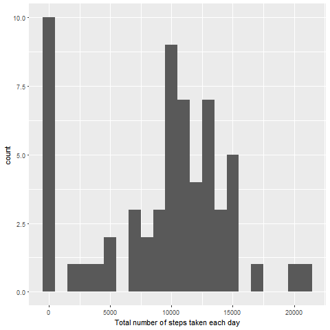
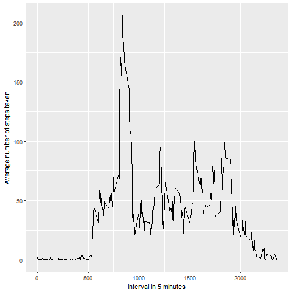
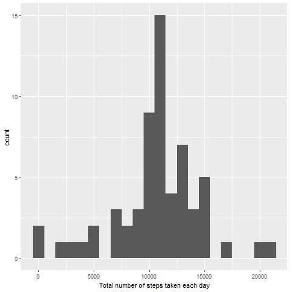
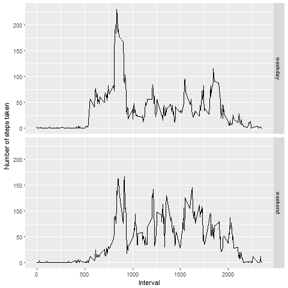

## Preparing the Environment

```r
# Clean up a little bit and set working directory.
# Load necessary libraries
rm(list = ls())
setwd("C:/Data Science/05 - Reproducible Research/project1/RepData_PeerAssessment1/")
library(ggplot2)
```

## Loading and preprocessing the data

```r
# Step 1
# Check and unzip the file
if (!file.exists("activity.csv")) {
    unzip("activity.zip")
}
# and then read it.
activityData <- read.csv("activity.csv", header = TRUE, comment.char = "")
```

## What is mean total number of steps taken per day?

```r
# Step 2
# 1. Plot the total number of steps taken per day

totalSteps <- tapply(activityData$steps, activityData$date, FUN = sum, na.rm = TRUE)
qplot(totalSteps, binwidth = 1000, xlab = "Total number of steps taken each day")
```

<!-- -->

```r
dev.copy(png, "figure/TotalStepsTakenEachDay.png")
```

```
## png 
##   3
```

```r
dev.off()
```

```
## png 
##   2
```

```r
# 2. Calcuate the mean and median
mean(totalSteps, na.rm = TRUE)
```

```
## [1] 9354.23
```

```r
median(totalSteps, na.rm = TRUE)
```

```
## [1] 10395
```


#### Mean 9354.23
#### Median 10395

## What is the average daily activity pattern?

```r
# Step 3
# 1. Plot Average Daily Acitivity Pattern

averageActivity <- aggregate(x = list(steps = activityData$steps), by = list(interval = activityData$interval),
                      FUN = mean, na.rm = TRUE)
ggplot(
    data = averageActivity, aes(x = interval, y = steps)) +
    geom_line() +
    xlab("Interval in 5 minutes") +
    ylab("Average number of steps taken")
```

<!-- -->

```r
dev.copy(png, "figure/AverageStepsTaken.png")
```

```
## png 
##   3
```

```r
dev.off()
```

```
## png 
##   2
```

```r
# 2. find out the maximum
averageActivity[which.max(averageActivity$steps),]
```

```
##     interval    steps
## 104      835 206.1698
```
####    interval    steps
#### 104      835 206.1698



## Imputing missing values

```r
# Step 4
# 1. Find out how much data is missing
missingData <- is.na(activityData$steps)
table(missingData)
```

```
## missingData
## FALSE  TRUE 
## 15264  2304
```

```r
# 2. Find a method to replace missing values
missingValue <- function(steps, interval) {

    if ( is.na(steps)) {
        mV <- (averageActivity[averageActivity$interval == interval, "steps"])
    }
    else {
        mV <- c(steps)
    }
        
           
    return(mV)
}

# 3. Create a new Data Set

fullData <- activityData
fullData$steps <- mapply(missingValue, fullData$steps, fullData$interval)

# 4. Compute the graph and print mean and median
totalSteps <- tapply(fullData$steps, fullData$date, FUN = sum)
qplot(totalSteps, binwidth = 1000, xlab = "Total number of steps taken each day")
```

<!-- -->

```r
dev.copy(png, "figure/TotalStepsTakenAfterFillingMissingData.png")
```

```
## png 
##   3
```

```r
dev.off()
```

```
## png 
##   2
```

```r
mean(totalSteps)
```

```
## [1] 10766.19
```

```r
median(totalSteps)
```

```
## [1] 10766.19
```

#### Mean 10766.19
#### Median 10766.19

#### The median seems to be around same value. But Mean has changed.
#### In the given method, both mean and median are same.



## Are there differences in activity patterns between weekdays and weekends?

```r
# Step 5
# activity pattern between week days and week ends

# 1. Create a new factor variable in the dataset with two levels – “weekday” and “weekend” indicating whether a given date is a weekday or weekend day.
checkWeekDayOrWeekEnd <- function(date) {
    day <- weekdays(date)
    if (day %in% c("Monday", "Tuesday", "Wednesday", "Thursday", "Friday"))
        return("weekday")
    else 
        return("weekend")
}

fullData$date <- as.Date(fullData$date)
fullData$day <- sapply(fullData$date, FUN = checkWeekDayOrWeekEnd)

#2. Make the plot now
averageActivity <- aggregate(steps ~ interval + day, data = fullData, mean)
ggplot(averageActivity, aes(interval, steps)) +
    geom_line() +
    facet_grid(day ~ .) +
    xlab("Interval") +
    ylab("Number of steps taken")
```

<!-- -->

```r
dev.copy(png, "figure/ActivityPatternWeekDaysAndWeekEnds.png")
```

```
## png 
##   3
```

```r
dev.off()
```

```
## png 
##   2
```

